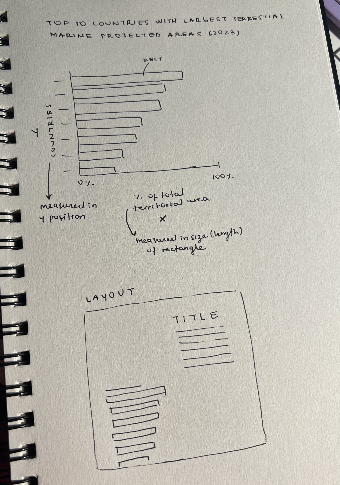
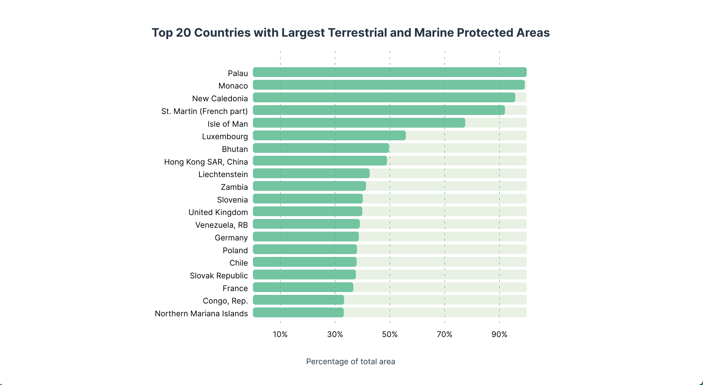

# Coding-Exercise-1

Hi there :)

For this class exercise, I drew an initial sketch to help me identify the types
of mapping I would have to use for the axes. As you can see, the Y axis
(vertical) contains categorical data, so I knew I had to use d3.scaleBand(). For
the X axis (horizontal) I used d3.scaleLinear(), as it had to show numerical,
continuous data (percentages, to be precise).

Initially I did not plan to add grid lines, but once I started programming, I
experimented with some designs. I settled on marking the odd dozens so that
users could easily identify which of the top 20 countries had more than 50% of
their territory protected. Lastly, I wanted to have a more complex layout for
the chart and title because I thought I would add a longer text to explain the
chart. However, I did not have much to write about, so I decided to keep the
chart and title horizontally centered.

